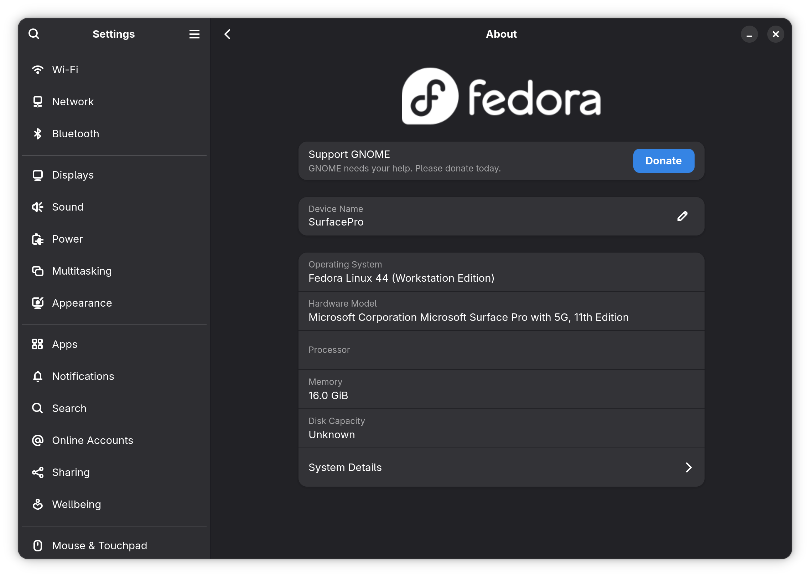

# Fedora Live ISO for Surface Pro 11 (Snapdragon X Elite, OLED, incl. the 5G SKU)



Builds a Fedora 45 live ISO (aarch64) that boots and installs on a Microsoft Surface Pro, 11th Edition with the
Samsung OLED panel (Snapdragon X Elite X1E80100). The kernel is Fedora's own kernel package
(`kernel-7.2.5-300.fc45`) with Fedora's configuration, rebuilt with the Surface Pro 11 patch set and shipped as
Fedora's usual `kernel`, `kernel-core` and `kernel-modules*` packages (`7.2.5-300.sp11.4.fc45.aarch64`); GRUB loads
the Denali OLED device tree. The build runs on the Surface itself, in WSL, and takes the unit's identity, Bluetooth
address, device firmware and sensor registry from its Windows installation, so every ISO is tailored to the unit
that built it. Secure Boot has to be off and Windows stays on the device (see Status and scope).

## What works

Tested on the 5G SKU (`Surface_Pro_with_5G_11th_Edition_2077`) with the kernel above in its current revision 4
(`7.2.5-300.sp11.4.fc45.aarch64`) and support RPM 3.2, installed fresh from the ISO built on 2026-09-24.
[`docs/verified.md`](docs/verified.md) has the details and what was confirmed with earlier kernels, including
ooaklee's v23 tree the project built until 2026-09-22.

| Feature | Fedora 45 Beta Workstation, Fedora's 7.2.5-300 (sp11.4) |
|---|:-:|
| Boot from the internal NVMe drive | yes |
| Display with GPU acceleration | yes |
| Backlight (brightness slider) | yes |
| Wi-Fi | yes |
| Bluetooth | yes |
| Touchscreen | yes |
| Multi-touch (pinch, two-finger scroll) | yes |
| Pen | yes |
| Speakers | yes |
| Microphone | yes |
| Keyboard and touchpad | yes |
| Battery status | yes |
| Power profiles (GNOME's Power Mode sets the Surface's platform profile) | yes |
| USB-C charging and data | yes |
| Suspend and resume | yes |
| Flatpak | yes |
| Windows in the GRUB menu | yes |
| Flex Keyboard and Slim Pen 2 pairings shared with Windows | yes |
| Sensors: readings from the accelerometer, gyroscope, magnetometer/compass and ambient light sensor (`ssccli`, `monitor-sensor`), with the sensors RPMs | yes |
| Sensors: auto-rotation on the desktop with the keyboard folded back or detached (GNOME's auto-rotate button), with the sensors RPMs | yes |
| Tablet mode: keyboard and touchpad off while the keyboard is folded back | yes |
| Sensors: automatic screen brightness | yes |
| 5G modem | no |
| Cameras | no |
| NPU (AI acceleration) | no |

*yes*: confirmed on the tested unit. *no*: not covered by this project.

In the live session, audio and battery status are unavailable because the audio DSP stays off while
running from USB-C; both work once installed.

## Status and scope

- Unofficial community project, not affiliated with Microsoft, Qualcomm, Fedora or ooaklee. No warranty.
- Tested only on the 5G OLED SKU. The hardware checks also accept the non-5G OLED SKUs
  (`Surface_Pro_11th_Edition_2076`, `Surface_Pro_11th_Edition_For_Business_2085`), which share the
  device tree, firmware file names and digitizer IDs; no build from one has been reported. The X1P64100
  LCD variant uses a different device tree and is rejected.
- Secure Boot must be disabled: the kernel is a local build of Fedora's kernel package and is not signed.
- Windows must stay on the device. The build reads the hardware identity, the built-in radio's Bluetooth
  address and the ADSP/CDSP/GPU firmware from it; without that firmware an installed system has no audio,
  battery reporting or GPU acceleration. The sensors packages also take the sensor configuration and this
  unit's sensor registry from it.
- The support RPM and the ISO contain proprietary Qualcomm firmware copied from your own Windows
  installation. Do not redistribute them; point other people to this repository instead.

## Quick start

Requirements: a Fedora aarch64 distribution in WSL on the Surface, Windows interop (`powershell.exe`), `sudo`
(passwordless for unattended runs), 80 GiB free disk space and internet access. Once per unit, export its sensor
registry from Windows (one UAC prompt):

```bash
scripts/75-export-sensor-registry.sh
```

Then build (the kernel takes about an hour after the downloads; keep WSL running):

```bash
scripts/build-all.sh
```

The ISO lands in `build/out/`, for example
`Fedora-Workstation-Live-45_Beta-1.3-SP11-7.2.5-300.sp11.4.fc45.aarch64.iso`, with a `.sha256` beside it. Every
option and step: [`docs/guide/build.md`](docs/guide/build.md). Writing the media and installing:
[`docs/guide/install.md`](docs/guide/install.md). Updating an installed system:
[`docs/guide/update.md`](docs/guide/update.md).

## Documentation

User guides:

- [`docs/guide/build.md`](docs/guide/build.md): requirements, the pipeline, its options, steps and checks.
- [`docs/guide/install.md`](docs/guide/install.md): writing the USB, the firmware settings, the installer, the
  first boot.
- [`docs/guide/update.md`](docs/guide/update.md): updating the support RPM and installing a new SP11 kernel.
- [`docs/guide/support-rpm-history.md`](docs/guide/support-rpm-history.md): what each support RPM version changed.
- [`docs/guide/bluetooth-pairings.md`](docs/guide/bluetooth-pairings.md): sharing the Flex Keyboard and Slim Pen 2
  pairings with Windows.
- [`docs/guide/sensors.md`](docs/guide/sensors.md): the sensors stack: install, update, check, reset.
- [`docs/guide/troubleshooting.md`](docs/guide/troubleshooting.md): diagnostics, known limitations, systems
  installed from earlier ISOs.
- [`docs/guide/design.md`](docs/guide/design.md): what the scripts decide for you, and why.
- [`docs/guide/new-release.md`](docs/guide/new-release.md): moving to a new Fedora compose or kernel.
- [`docs/guide/layout.md`](docs/guide/layout.md): what each file of the repository is.
- [`docs/guide/credits.md`](docs/guide/credits.md): license and credits.

Working notes, the verified facts the guides rest on (indexed by `CLAUDE.md`):
[`docs/pipeline.md`](docs/pipeline.md) (the pipeline, its caches and pitfalls),
[`docs/hardware.md`](docs/hardware.md) (the tested unit, its peripherals and firmware),
[`docs/kernel.md`](docs/kernel.md) (the kernel build and its revisions),
[`docs/kernel-patches.md`](docs/kernel-patches.md) (the patch manifest),
[`docs/fedora-media.md`](docs/fedora-media.md) (the live media, GRUB and Anaconda),
[`docs/sensors.md`](docs/sensors.md) (the sensors stack) and [`docs/verified.md`](docs/verified.md) (device
results by date).

## License

GPL-3.0-or-later for the repository's content (`LICENSE`). Everything third-party is downloaded and packaged at
build time, and the proprietary firmware and sensor files come from your own Windows installation and never enter
the repository: [`docs/guide/credits.md`](docs/guide/credits.md).
