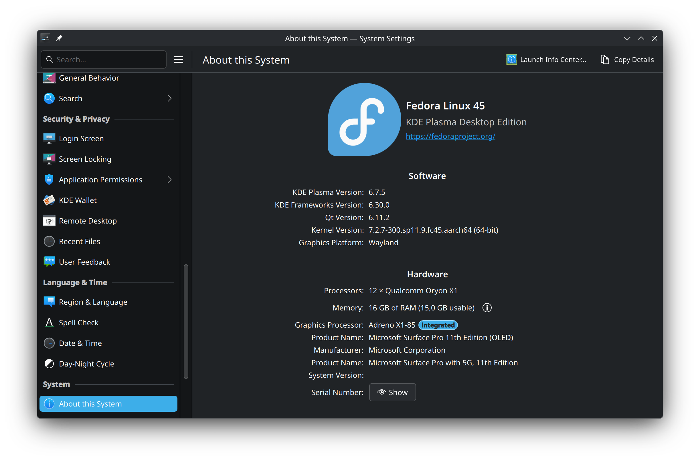

# Fedora Live ISO for Surface Pro 11 (Snapdragon X Elite, OLED, incl. the 5G SKU)



Builds a Fedora 45 live ISO (aarch64) that boots and installs on a Microsoft Surface Pro, 11th Edition with the
Samsung OLED panel (Snapdragon X Elite X1E80100). The kernel is Fedora's own kernel package
(`kernel-7.2.8-300.fc45`) with Fedora's configuration, rebuilt with the Surface Pro 11 patch set and shipped as
Fedora's usual `kernel`, `kernel-core` and `kernel-modules*` packages (`7.2.8-300.sp11.10.fc45.aarch64`). GRUB
loads the Denali OLED device tree. The build runs on the Surface itself, in WSL, and tailors every ISO to the unit
that built it with files from its Windows installation. Secure Boot has to be off and Windows stays on the device
(see Status and scope).

## What works

Tested on the 5G SKU (`Surface_Pro_with_5G_11th_Edition_2077`). The KDE Plasma Desktop column was confirmed on the
installation of 2026-09-30 (`FEDORA_EDITION=KDE-Desktop`), running kernel revision 10
(`7.2.8-300.sp11.10.fc45.aarch64`) and support RPM 3.4; the Workstation column on an installation from the ISO
built on 2026-09-24, with revision 9 (`7.2.7-300.sp11.9.fc45.aarch64`) and support RPM 3.4.
[`docs/verified.md`](docs/verified.md) has the details and the results with earlier kernels.

| Feature | Fedora 45 Beta Workstation, Fedora's 7.2.7-300 (sp11.9) | Fedora 45 Beta KDE Plasma Desktop, Fedora's 7.2.8-300 (sp11.10) |
|---|:-:|:-:|
| Boot from the internal NVMe drive | yes | yes |
| Display with GPU acceleration | yes | yes |
| Backlight (brightness slider) | yes | yes |
| Wi-Fi | yes | yes |
| Bluetooth | yes | yes |
| Touchscreen | yes | yes |
| Multi-touch (pinch, two-finger scroll) | yes | yes |
| Pen | yes | yes |
| Speakers | yes | yes |
| Microphone | yes | yes |
| Keyboard and touchpad | yes | yes |
| Battery status | yes | yes |
| Power profiles (GNOME: its Power Mode sets the Surface's platform profile) | yes | yes |
| USB-C charging and data | yes | yes |
| Suspend and resume | yes | yes |
| Flatpak | yes | yes |
| Windows in the GRUB menu | yes | yes |
| Flex Keyboard and Slim Pen 2 pairings shared with Windows | yes | yes |
| Sensors: readings from the accelerometer, gyroscope, magnetometer/compass and ambient light sensor (`ssccli`, `monitor-sensor`), with the sensors RPMs | yes | yes |
| Sensors: auto-rotation on the desktop, with the sensors RPMs (GNOME: its auto-rotate button, with the keyboard folded back or detached) | yes | yes |
| Tablet mode: keyboard and touchpad off while the keyboard is folded back | yes | yes |
| Sensors: automatic screen brightness | yes | yes |
| 5G modem | no | no |
| Cameras: front and rear (GNOME Snapshot, Firefox) | yes | yes |
| Front camera's light while the camera is in use | yes | yes |
| IR camera (face login) | no | no |
| NPU (AI acceleration) | no | no |

*yes*: confirmed on the tested unit. *no*: not covered by this project. Under KDE Plasma, auto-rotation could stop
until iio-sensor-proxy was restarted; the sensors RPMs fix this since 2026-10-07 (libssc 0.4.4-3,
[`docs/guide/troubleshooting.md`](docs/guide/troubleshooting.md)).

In the live session, audio and battery status are unavailable because the audio DSP stays off while running from
USB-C. Both work once installed.

## Status and scope

- Unofficial community project, not affiliated with Microsoft, Qualcomm, or Fedora. No warranty.
- Tested only on the 5G OLED SKU. The hardware checks also accept the non-5G OLED SKUs
  (`Surface_Pro_11th_Edition_2076`, `Surface_Pro_11th_Edition_For_Business_2085`), which share the device tree
  and firmware; no build from one has been reported. The X1P64100 LCD variant uses a different device tree and is
  rejected.
- Secure Boot must be disabled: the kernel is a local build of Fedora's kernel package and is not signed.
- Windows must stay on the device: the build reads the hardware identity, the built-in radio's Bluetooth address,
  the ADSP/CDSP/GPU firmware and the sensor configuration and registry from it. Without the firmware an installed
  system has no audio, battery reporting or GPU acceleration.
- The support RPM and the ISO contain proprietary Qualcomm firmware copied from your own Windows installation. Do
  not redistribute them; point other people to this repository instead.

## Quick start

Requirements: a Fedora aarch64 distribution in WSL on the Surface, Windows interop (`powershell.exe`), `sudo`
(passwordless for unattended runs), 80 GiB free disk space and internet access.

Once per unit, export its sensor registry from Windows (one UAC prompt):

```bash
scripts/75-export-sensor-registry.sh
```

Then build. The kernel takes about an hour after the downloads; keep WSL running meanwhile:

```bash
scripts/build-all.sh
```

For the KDE Plasma Desktop image instead of Workstation (the kernel and RPMs are the same and are reused):

```bash
FEDORA_EDITION=KDE-Desktop scripts/build-all.sh
```

The ISO lands in `build/out/`, for example
`Fedora-Workstation-Live-45_Beta-1.3-SP11-7.2.8-300.sp11.10.fc45.aarch64.iso` or
`Fedora-KDE-Desktop-Live-45_Beta-1.3-SP11-7.2.8-300.sp11.10.fc45.aarch64.iso`, with a `.sha256` beside it.

- Every option and step: [`docs/guide/build.md`](docs/guide/build.md).
- Writing the media and installing: [`docs/guide/install.md`](docs/guide/install.md).
- Updating an installed system: [`docs/guide/update.md`](docs/guide/update.md).

## Documentation

User guides:

- [`docs/guide/build.md`](docs/guide/build.md): requirements, the pipeline, its options, steps and checks, building
  one set of RPMs alone.
- [`docs/guide/install.md`](docs/guide/install.md): writing the USB, the firmware settings, the installer, the
  first boot.
- [`docs/guide/update.md`](docs/guide/update.md): updating the support RPM and installing a new SP11 kernel.
- [`docs/guide/support-rpm-history.md`](docs/guide/support-rpm-history.md): what each support RPM version changed.
- [`docs/guide/bluetooth-pairings.md`](docs/guide/bluetooth-pairings.md): sharing the Flex Keyboard and Slim Pen 2
  pairings with Windows.
- [`docs/guide/sensors.md`](docs/guide/sensors.md): the sensors stack: install, update, check, reset.
- [`docs/guide/troubleshooting.md`](docs/guide/troubleshooting.md): diagnostics, known limitations, systems
  installed from earlier ISOs.
- [`docs/guide/design.md`](docs/guide/design.md): what the scripts decide for you, and why.
- [`docs/guide/new-release.md`](docs/guide/new-release.md): moving to a new Fedora compose or kernel.
- [`docs/guide/layout.md`](docs/guide/layout.md): what each file of the repository is.
- [`docs/guide/credits.md`](docs/guide/credits.md): license and credits.

Working notes, the verified facts the guides rest on (indexed by `CLAUDE.md`):

- [`docs/pipeline.md`](docs/pipeline.md): the pipeline, its caches and pitfalls.
- [`docs/hardware.md`](docs/hardware.md): the tested unit, its peripherals and firmware.
- [`docs/kernel.md`](docs/kernel.md): the kernel build and its revisions.
- [`docs/kernel-patches.md`](docs/kernel-patches.md): the patch manifest.
- [`docs/fedora-media.md`](docs/fedora-media.md): the live media, GRUB and Anaconda.
- [`docs/sensors.md`](docs/sensors.md): the sensors stack.
- [`docs/camera.md`](docs/camera.md): the cameras.
- [`docs/verified.md`](docs/verified.md): device results by date.

## License

GPL-3.0-or-later for the repository's content (`LICENSE`). Everything third-party is downloaded and packaged at
build time. The proprietary firmware and sensor files come from your own Windows installation and never enter the
repository. Details: [`docs/guide/credits.md`](docs/guide/credits.md).
